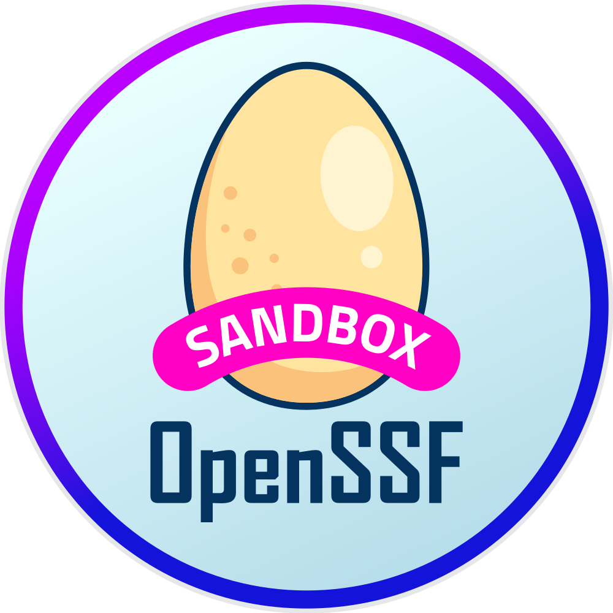

# protobom





`protobom` is a [protocol buffers](https://protobuf.dev/getting-started/)
representation of SBOM data able to ingest documents in modern
[SPDX](https://spdx.dev/) and [CycloneDX](https://cyclonedx.org/) versions
without loss. It has an accompanying Go library generated from the protocol
buffers definition that also implements ingesters for those formats.

Standard SBOMs are read by a reader using [unserializers](docs/unserializers.md) that
understand the common formats. Unserializers create a neutral protobom from data
read from CycloneDX or SPDX documents.

A protobom can be rendered into standard SBOM formats by the writer using
[serializers](docs/serializers.md) that know how to generate those documents.

## Supported Versions and Formats

The following table summarizes the current support for formats and encodings in
the golang library.

| Format | Version | Encoding | Read | Write |
| --- | --- | --- | --- | --- |
| SPDX | 2.2 | JSON | planned | - |
| SPDX | 2.2 | tag-value | planned | - |
| SPDX | 2.3 | JSON | supported | supported|
| SPDX | 2.3 | tag-value | planned | - |
| SPDX | 3.0 | JSON | planned | planned |
| CycloneDX | 1.4 | JSON | supported | supported |
| CycloneDX | 1.5 | JSON | supported | supported |
| CycloneDX | 1.6 | JSON | supported | supported |

Other read and write implementations can potentially be written in
other [languages supported by protobuf](https://protobuf.dev/getting-started/)

## Usage

The `protobom` library can be used to read in and write out SBOM documents in any of the above formats.

### Example 1:  The sbom-convert project

https://github.com/protobom/sbom-convert provides a complete example of using the library to ingest an SBOM into the protobom intermediate format and then write out a new SBOM document in a different format.

### Example 2:  Read in SBOM document to work with specific field(s)

The `protobom` library is the best and easiest way to interact with SBOM documents using the Go programming language.  In this example, we show how to easily access the SBOM programmatically by creating a new protobom `Reader`, and calling `reader.ParseFile()` to read an SBOM document file and return a protobom sbom.Document.  In this example, protobom handles the document unserialization regardless of the format.  The developer using protobom can then work with a consistent protobom intermediate representation with the actual file format abstracted away.

This particular example iterates over each node of the SBOM document's list of nodes and prints the ID, Name, and Version of each node.  If the input document is an SPDX SBOM, each protobom Node will describe a single SPDX package.  If the input document is a CycloneDX SBOM, each protobom Node will describe a CycloneDX component.  The developer using protobom does not need to change the code based on the input format.  The protobom library parses the input document to present an intermediate format of the data allowing the developer to work with a consistent intermediate format instead.

```golang
package main

import (
	"fmt"

	"github.com/protobom/protobom/pkg/reader"
)

func main() {
	// Create a new protobom SBOM reader:
	reader := reader.New()
	document, err := reader.ParseFile("sbom.spdx.json")
	if err != nil {
		fmt.Printf("ERROR: %v\n", err)
		return
	}

	// List all nodes in the SBOM and print some information about them:
	for _, node := range document.GetNodeList().GetNodes() {
		fmt.Printf("Node ID [%v]: name: %v version: %v\n", node.GetId(), node.GetName(), node.GetVersion())
	}
}
```

### Example 3:  Generate an SBOM document programmatically

Developers can use the `protobom` library to generate SBOM documents based on the content of a separate SBOM document, as shown by the sbom-convert project (https://github.com/protobom/sbom-convert).

However, the `protobom` intermediate representation could also be used to create a new SBOM document.  Developers could create a new `protobom` document and use the Go programming language to populate the fields needed in the SBOM document.  The developer would then create a new Writer to define where the SBOM should be written, and to which format the SBOM should be written passing in the programmatically-defined SBOM structure.  The protobom v0.2.0 release includes six registered serializer formats for Writer.New(): SPDX23JSON, CDX12JSON, CDX13JSON, CDX14JSON, CDX15JSON, and CDX16JSON.

```golang
package main

import (
	"os"

	"github.com/protobom/protobom/pkg/formats"
	"github.com/protobom/protobom/pkg/sbom"
	"github.com/protobom/protobom/pkg/writer"
)

func main() {
	// Create a new protobom document
	document := sbom.NewDocument()
	// Populate some of the document metadata:

	// ...for example the author:
	document.Metadata.Authors = append(
		document.Metadata.Authors,
		&sbom.Person{Name: "John Doe"},
	)

	// ...and the tool that produced the SBOM:
	document.Metadata.Tools = append(
		document.Metadata.Tools,
		&sbom.Tool{
			Name:    "ACME SBOM Tool",
			Version: "1.0",
			Vendor:  "ACME Corporation"},
	)

	// Create a node to represent the application:
	appNode := &sbom.Node{
		Id:               "pkg:generic/my-software@v1.0.0",
		PrimaryPurpose:   []sbom.Purpose{sbom.Purpose_APPLICATION},
		Name:             "My Software Name",
		Version:          "v1.0.0",
		Licenses:         []string{"Apache-2.0"},
		LicenseConcluded: "Apache-2.0",
		LicenseComments:  "Apache License",
	}

	// Add the application node to the document's nodelist:
	document.NodeList.AddRootNode(appNode)

	// Create two nodes to describe files in the application

	node1 := &sbom.Node{
		Id:          "File--usr-lib-libsoftware.so",
		Type:        sbom.Node_FILE,
		Name:        "/usr/lib/libsoftware.so",
		Version:     "1",
		Copyright:   "Copyright 2023 The ACME Corporation",
		Description: "Software Lib",
	}

	node1.AddHash(sbom.HashAlgorithm_SHA1, "f3ae11065cafc14e27a1410ae8be28e600bb8336")
	node1.AddHash(sbom.HashAlgorithm_SHA256, "4f232eeb99e1663d07f0af1af6ea262bf594934b694228e71fd8f159f9a19f32")
	node1.AddHash(sbom.HashAlgorithm_SHA512, "8044d0df34242699ad73bfe99b9ac3d6bbdaa4f8ebce1e23ee5c7f9fe59db8ad7b01fe94e886941793aee802008a35b05a30bc51426db796aa21e5e91b7ed9be")

	document.NodeList.AddNode(node1)

	node2 := &sbom.Node{
		Id:          "File--usr-bin-software",
		Type:        sbom.Node_FILE,
		Name:        "/usr/bin/software",
		Version:     "1.0",
		Copyright:   "Copyright 2023 The ACME Corporation",
		Description: "Software binary",
	}

	node2.AddHash(sbom.HashAlgorithm_SHA1, "defee82004d22fc92ab81c0c952a62a2172bda8c")
	node2.AddHash(sbom.HashAlgorithm_SHA256, "ad291c9572af8fc2ec8fd78d295adf7132c60ad3d10488fb63d120fc967a4132")
	node2.AddHash(sbom.HashAlgorithm_SHA512,  "5940d8647907831e77ec00d81b318ca06655dbb0fd36d112684b03947412f0f98ea85b32548bc0877f3d7ce8f4de9b2c964062df44742b98c8e9bd851faecce9")

	// Relate the application package and the files. This adds the nodes to
	// the document graph:
	document.RelateNodeAtID(node1, appNode.Id, sbom.Edge_contains)
	document.RelateNodeAtID(node2, appNode.Id, sbom.Edge_contains)

	// Now render the document to STDOUT:
	w := writer.New()

	// Write the SBOM to STDOUT in SPDX 2.3:
	w.WriteStreamWithOptions(
		document, os.Stdout, &writer.Options{Format: formats.SPDX23JSON},
	)

	// Write the SBOM to STDOUT in CycloneDX 1.4:
	w.WriteStreamWithOptions(
		document, os.Stdout, &writer.Options{Format: formats.CDX14JSON},
	)
}
```

------


## Join the Protobom Community!

- Come and say hi on [`#protobom` on OpenSSF Slack](https://openssf.slack.com/archives/C06ED97EQ4B).
- [Protobom Community Meeting](https://zoom-lfx.platform.linuxfoundation.org/meeting/93849959680?password=414218a0-8865-4cea-ba62-99443815ceff) - Every other Wednesday at 10am Pacific. 
- [OpenSSF Security Tooling Working Group Meeting](https://zoom-lfx.platform.linuxfoundation.org/meeting/94897563315?password=7f03d8e7-7bc9-454e-95bd-6e1e09cb3b0b) - Every other Friday at 8am Pacific.
- [SBOM Tooling Working Meeting](https://zoom-lfx.platform.linuxfoundation.org/meeting/92103679564?password=c351279a-5cec-44a4-ab5b-e4342da0e43f) - Every Monday, 2pm Pacific.
