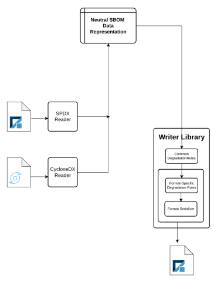

# SBOM Translation Project

**Adolfo García Veytia** &lt;<u>puerco@chianguard.dev&gt;</u>

Proposed 2023-05-16 ***- (DRAFT)***

***TO:** DHS SBOM Cohort*

## Overview

This proposal delineates a project to create a conversion model and
companion libraries and tools to convert SBOMs between SPDX, CyloneDX,
potentially other formats too. The model attempts to improve on the
current handling of SBOM documents, which is mostly JSON manipulation.
Instead, this approach focuses on “semantics” field so that conversion
can move and transform data, maintain the semantics, and, if possible,
avoid data loss.
>
The project encompasses four main components, dividing the work
requirements into design, programming, and documentation.
>
1. A universal, format-neutral protocol buffers data structure that
allows capturing the data from any SBOM format losslessly.
2. A set of read and write Go libraries:
    - Reader libraries that can read any SBOM and serialize them into
the protobuf structure
    - Writer libraries that can render a standard format bill of
materials from the protobuf structure
3. A golang cli tool that converts documents from one format to another leveraging those libraries.
4. Finally, a well-documented degradation strategy to understand how
data loss happens when going from the neutral representation to each
of the supported formats.

The advantages of this architecture are detailed in the sections
below.

## Background

Translating between software bill of materials formats results in data
loss. There is no way around it. And there is a lot more at stake than
just shuffling around data bits from one field to another;
SBOM format translation is really about trying to conserve
the semantic meaning of elements described in an SBOM as much as
possible.

This project describes a conversion scheme that attempts to create a
canonical way of converting documents. For the past months, some
engineers from SPDX and CycloneDX have worked together privately, trying
to achieve the best possible compromises to convert between both
formats. This resulted in some of the changes in SPDX 2.3. While this
effort is laudable, the reality in the field is that producers and
consumers will face a more complex scenario, necessitating a more
comprehensive approach than improvements to formats. Old formats are
there. Tools are already using them. No one is going back to improve
already existing SBOMs.

SBOM handling up until now has been based on shallow JSON parsing to
ingest opinionated and often wrongly formatted documents. Most
first-generation SBOM tools treat SBOMs as the resulting data
structure of unmarshalling a JSON file. It is not uncommon to see
“consumption tools” reducing SBOM data to a flat list of dependencies.
In a world lacking more advanced parsers and SBOMs of poor quality, it
is not hard to blame them. When discussing next-generation tools in
this document we mean applications dealing with SBOM problems and
tasks that require this smarter ingestion of documents.

FIXME SBOM processing limited to shallow JSON parsing is insufficient.

## Goals

- A library that abstracts any standard SBOM into a format-neutral
data representation containing packages and files related to each
other.
- The library must have the ability to ingest data from SPDX and
CycloneDX in any reasonably recent and future versions.
- Zero data loss from SBOM to the internal representation.
- Ability to export SBOM data to current SPDX and CycloneDX versions
- Tolerance for SBOM validity errors. The library should be able to
ingest SBOMs that are not 100% conformant to their specifications
while being able to understand (and remediate those errors).
- Planned degradation when rendering to each format/version pairt when
lacking enough resolution to capture data.
- As a foundational piece, it will be strongly conformance tested to
ensure a consistent behavior facing an SBOM landscape that is highly
inconsistent.
- Extensible enough to accommodate future SBOM formats
- Minimal implementation with the least number of dependencies
possible to limit the impact on projects when importing it.

## Non-Goals

- ***Most Important Non-Goal: A new SBOM format!***
- Support for each format’s non-SBOM features (ie vulnerability data,
provenance, VEX, etc)
- SBOM generation
- SBOM composition
- Any feature beyond ingestion, internal representation. and export.
While this library is intended to be a foundational piece of a wider
ecosystem, the project itself needs to be scoped to be just a library
to make SBOM handling easy.
- Creating clever hacks to avoid data loss, examples include cramming
data into comments, annotations, etc.

## Detailed Design

Conversion Schema

Effectively, SBOM conversion will be a three-step process:

1. Ingesting the documents through format-specific reader libraries
into the neutral representation.
2. Applying a set of degradation rules, both common to all formats
and specific to the target serialization format.
3. Passing the data through a format-specific serializer library.

## Serializing To Protocol Buffers
>
Protocol buffers (or *protobuf* for short) provide a mechanism to
serialize structured data into a language-neutral format. It is
designed to play well with most languages and enable efficient
transmission. Protobuf lets software developers define a data
structure once and reuse it in other implementations. The project
provides library generators for some of the most popular languages
including C++, C#, Go, Java, and Python while 3rd party
implementations are available for others.

An example protobuf structure:

JavaScript:

    message Package {
      string id = 1;
      string name = 2;
      string license = 3;
      string purl = 4;
    }

The protocol buffers structure can then be used to generate native
code, for example in Go.

C/C++:

    type Package struct {
      ID string
      Name string
      License string
      Purl string
    }

The centralized nature of the protobuf neutral representation gives
the project a better chance to be more widely adopted. Combined with
the written degradation strategy and strong conformance tests,
implementing either writers or readers in other languages should prove
to be straightforward.

The neutral representation should not be a new SBOM format but rather
a data structure that captures all data from existing formats. The
project is not aiming for expressivity or optimizing for lean
documents but rather designing a structure detailed enough to capture
all fields in the current standards that is also capable of
maintaining the SBOM structure.

## A Software Bill of Materials Format-Agnostic Data Structure

#### The SBOM Graph

Both major SBOM formats, CycloneDX and SPDX, model their data in a
directed graph. SPDX was modeled as a graph from the start (as it was
based on RDF) while CycloneDX had a components tree and added
relationships to its nodes to be able to describe a dependency tree.

In essence, the SBOM graph groups together *entry* or *top-level*
nodes which are ideally related to other elements to model the
structure of a piece of software. Those nodes include the structural
pieces of the software piece (binaries, library files, layers of a
container image, etc) and its components. The notion of “component” in
this section of the design document can extend from internal pieces of
the software piece itself, all the way to build environment tools,
tests, and anything the SBOM author and receiver deem relevant to
express as part of the SBOM description.

Nodes in the SBOM graph can be finalized as either packages or files
which are the most finely-grained elements common to both SBOM
formats1. The following graph pictures a simple example of
a graph and the relationships between its nodes.

1SPDX has also snippets, which are smaller than packages
or files. These, however, are not in scope for the project and are
rarely used.

*A simplified SBOM graph*

#### The Nodes

The SBOM graph is composed of nodes related to each other. Nodes can
be either packages or files but any successful handling of SBOM data
necessarily means traversing the graph regardless of kind. The model
should handle all SBOM elements as abstract nodes while keeping awareness
of their kind.

The data model used to capture each kind of node is extensible and can
load and record any number of properties. The project intends to keep
the internal representation model extensible, independent of the
limitation of each format.

#### Relationships Between Nodes

While SPDX has a rich relationship system, CycloneDX does not.
Nevertheless, CycloneDX’s dependency tree is also formed by related
nodes. The data model models the CDX tree using two relationship types
(one for the dependency graph, and one for the components tree). No
attempt is made to endow meaning to relationships between nodes in the
CDX documents beyond those inferred from their position in the
<a href=https://cyclonedx.org/docs/1.4/json/#components>components tree</a>
or the <a href=https://cyclonedx.org/docs/1.4/json/#dependencies>dependency graph.</a>
This is true even if the SBOM contains data about the role one or more nodes have
in the described software. For example, even if we infer a set of
files or packages to be a test, the ingestion process will not attempt
to relate them using a TEST\_OF SPDX relationship2 when
adding them to the neutral structure. SPDX3 <a href=https://github.com/spdx/spdx-3-model/blob/main/model/Core/Classes/Relationship.md>
expands on the relationship model</a>3 and relationships can be subclassed
and carry additional data, another fact the data representation needs
to account for.

#### Data Export and Data Loss

While the neutral data model is designed to capture all data in the
graph nodes, data loss can and will happen when rendering SBOMs to
each of the formats. While it is inevitable to lose data, the project
will have a predictable, documented degradation strategy that users
can rely on and expect. This document does not capture the strategy
yet as it will be documented as support to output to each format and
version progresses.

Some degradation rules will apply globally (see the Relationships
example above), while others will apply only when addressing the
limitations of a particular format+version.

In no case will the ingestion process attempt to cram data into SBOMs
when there is no appropriate field for it. This means the library will
never use hacks such as using annotations or comments to perpetuate
data. Also, no custom extensions will be used even when formats may
support them.

2See the <a href=https://spdx.github.io/spdx-spec/v2.3/relationships-between-SPDX-elements/>relationships
chapter</a> on the SPDX specification for more on the kinds of relationships available.
3See the
current SPDX3 model relationship proposal:
https://github.com/spdx/spdx-3-model/blob/main/model/Core/Classes/Relationship.md

### Drawbacks

#### Loss of Expanded Format Capabilities

Working with the converter library will make it easier for developers
to consume and work with SBOMs. However, the library will not account
for each format’s features beyond those related to the Software Bill
of Materials realm. If the project becomes successful, it could hinder
the adoption of those features in the formats. We feel that the
improvements the project offers to the overall SBOM landscape are
worth it, especially since there are alternatives for the other
features of the documents (like OpenVEX, SLSA, and even CSAF for
advisories).

### Core Open Questions

As the design progresses some bigger open questions start to emerge
which need to be addressed before the final design is in place.

- How to handle CycloneDX’s <a href=https://cyclonedx.org/docs/1.4/json/#metadata_component>
limitation of one top-level component</a>4 per SBOM
- Do we handle multiple (previous) formats of CDX/SPDX, or default to the latest
- How to handle relationship types that may not have a clear equivalency. The two
obvious examples that come to mind are:
    - CycloneDX losing all relationship data when converting from SPDX
    - SPDX3 has directional relationships but the SPDX2 inverted
relationships are no longer supported. This means that the graph needs
to be modified (<a href=https://github.com/spdx/spdx-3-model/issues/356>
I’ve opened an issue here</a> to try to keep them for compatibility).
- Licenses. Both of the major formats (CDX and SPDX) express licensing
data using SPDX identifiers. Should we try to pursue further
validation of the license tags? The alternative would be to treat them
as strings and shuffle them around as the come in.
- Known unknowns: NOASSERTION in SPDX is not the same as null. How do
we handle these known unknowns between formats?

4See https://cyclonedx.org/docs/1.4/json/#metadata\_component

## Appendix A: Data Structure Proposals

### Proposal 1: Wide-breadth structure to capture all SBOM fields.

Repository: <u>https://github.com/puerco/protobom/tree/full</u>

(Note that this lives in the full branch)

The first proposal includes a graph structure with a <a href=https://github.com/puerco/protobom/blob/048bb38a25fcee0c4973c90994152128c9bd7abc/api/sbom.proto#L15-L55>
single node type</a> that can capture both packages and files in the SBOM. The
node data structure has enough fields to capture all data losslessly.
Nodes representing files and packages are differentiated with a <a href=https://github.com/puerco/protobom/blob/048bb38a25fcee0c4973c90994152128c9bd7abc/api/sbom.proto#L17>
Type field.</a>

I’ve committed to the repo both the <a href=https://github.com/puerco/protobom/blob/full/api/sbom.proto>proto</a>
and the <a href=https://github.com/puerco/protobom/blob/full/pkg/sbom/sbom.pb.go>generated go library.</a>

Regarding completion, the node data should be able to capture all
information in SPDX 3, 2.x and CycloneDX 1.4. The <a href=https://github.com/puerco/protobom/blob/048bb38a25fcee0c4973c90994152128c9bd7abc/api/sbom.proto#L57-L65>document
metadata</a> is mostly complete but needs a check to ensure that it is
capturing all required fields. There are specialized structs to record
tools and persons.

The graph edge which captures the relationships between nodes needs to
be expanded to capture the SPDX3 semantics, but for now, it can work
to complete the graph model
